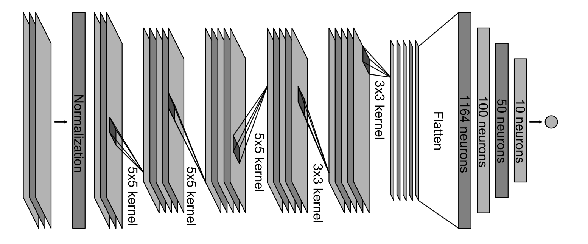

# Behavioral Cloning 🚔
[](http://www.udacity.com/drive)

<p align="center">
   
</p>

This project uses a Convolutional Neural Network model to attemp to learn how to drive a car in a simulator by trying to replicate the same driving behaviour. The model is only fed 3 image streams from 3 cameras on the car and the current steering wheel angle. No other data is given by the simulator.

----

### Simulator

The car simulator used to gather training data is made by Udacity for their [Self-Driving Car Nanodegree](https://www.udacity.com/drive) program, download it here:

   [MacOS](https://d17h27t6h515a5.cloudfront.net/topher/2017/February/58983385_beta-simulator-mac/beta-simulator-mac.zip)   [Windows](https://d17h27t6h515a5.cloudfront.net/topher/2017/February/58983318_beta-simulator-windows/beta-simulator-windows.zip)   [Linux](https://d17h27t6h515a5.cloudfront.net/topher/2017/February/58983558_beta-simulator-linux/beta-simulator-linux.zip) 


### Running the neural network

```sh
docker run 4567:4567 -it --rm -v `pwd`:/src madhorse/behavioral-cloning python3 drive.py model.h5
```
open your simulator and go in Autonomous Mode

### Running training

To run training on the model, use [nvidia-docker](https://github.com/NVIDIA/nvidia-docker) in order to train on the GPU,
use the following commands:

```sh
git clone https://github.com/Charles-Catta/Behavioral-Cloning.git

cd Behavioral-Cloning

wget https://d17h27t6h515a5.cloudfront.net/topher/2016/December/584f6edd_data/data.zip

unzip data.zip

rm data.zip

nvidia-docker run -it --rm -v `pwd`:/src madhorse/behavioral-cloning python3 model.py
```


### Model Architecture



The model architecture for this project is based on Nvidia's paper on [_End to end learning for self-driving cars_](http://images.nvidia.com/content/tegra/automotive/images/2016/solutions/pdf/end-to-end-dl-using-px.pdf)

All of the data preprocessing steps are outlined in the [Jupyter notebook](https://nbviewer.jupyter.org/github/Charles-Catta/Behavioral-Cloning/blob/master/Behavioral_Cloning.ipynb)

